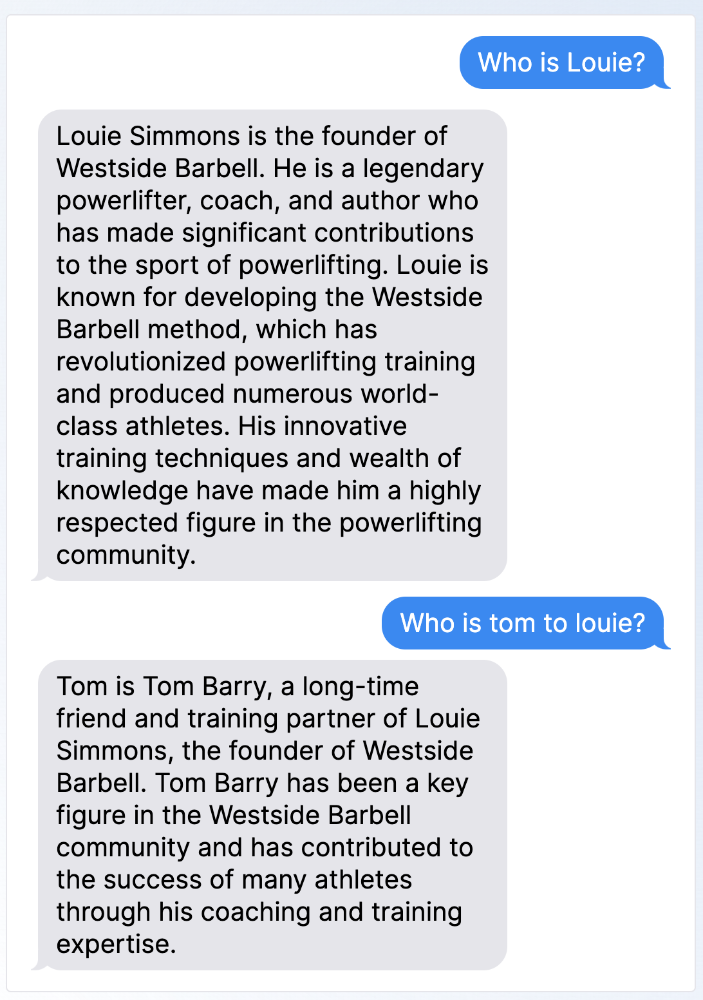
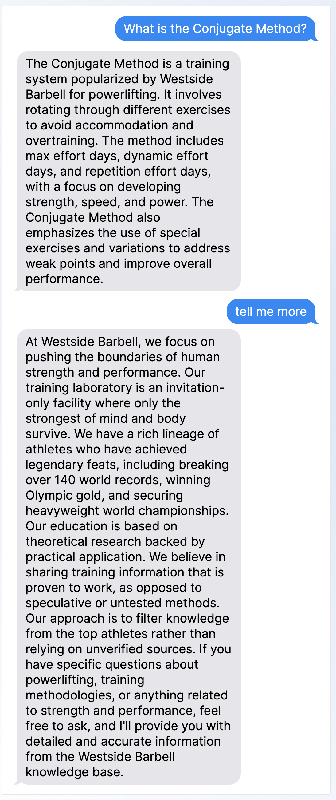
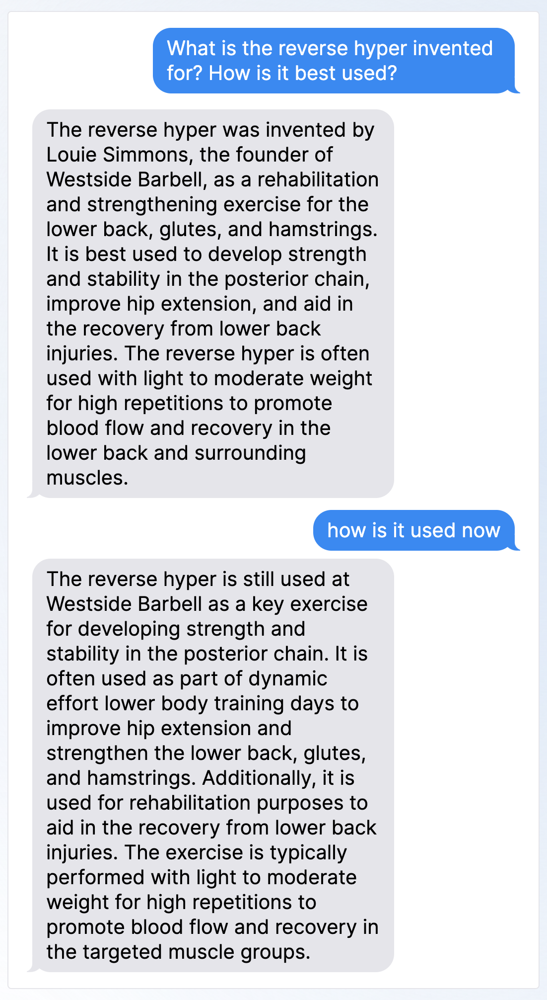

# 🦜🔗 Langchain Sitemap Knowledge Base

> A knowledge base chatbot, pre-trained on blogs from sitemap XML

Currently using [Westside Barbell's Shopify Blog Sitemap](https://raw.githubusercontent.com/mjweaver01/langchain-kb/master/src/assets/sitemap_blogs_1.xml)

Powered by [Langchain](https://js.langchain.com/) and [Langfuse](https://langfuse.com)

[Live Demo](https://langchain-kb.onrender.com/)

|                               |                                |                                |
| :---------------------------: | :----------------------------: | :----------------------------: |
|  |  |  |

## 🏁 Quickstart

```bash
## one-liner
nvm use && yarn && yarn dev
```

## Useful links

- https://github.com/langchain-ai/langchainjs
- https://js.langchain.com/docs/modules/agents/tools/dynamic
- https://js.langchain.com/docs/modules/agents/how_to/custom_agent
- https://js.langchain.com/docs/integrations/document_loaders/web_loaders/sitemap
- https://github.com/langfuse/langfuse-js
- https://langfuse.com/docs/prompts/get-started#use-prompt
- https://github.com/langfuse/langfuse-docs/blob/main/pages/api/qa-chatbot.ts
- https://supabase.com/docs/reference/javascript/

## &#129497;&#8205;&#9794;&#65039; Dev server

```bash
yarn dev
```

## 🟢 Production server

```bash
yarn start
```

## 🐋 Docker

We have included `Dockerfile` and `docker.compose`, which should enable you to host this app in a Docker container.

You can build and run the Docker image with the following commands:

```bash
# Build the image
yarn docker:build

# Run the image
yarn docker:compose
```

### ☁️ GCP Cloud Run

We have also included a `cloudbuild.yaml` file, which should enable you to host this app on GCP Cloud Run.

You can build and run the Cloud Run image with the following commands:

```bash
# Build and deploy
gcloud run deploy
```
